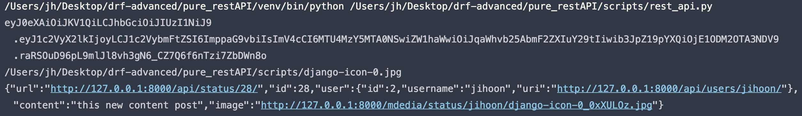
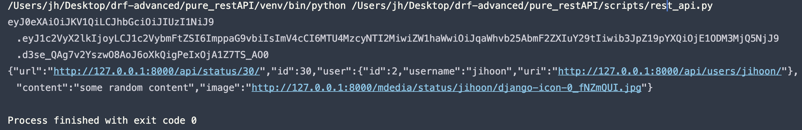
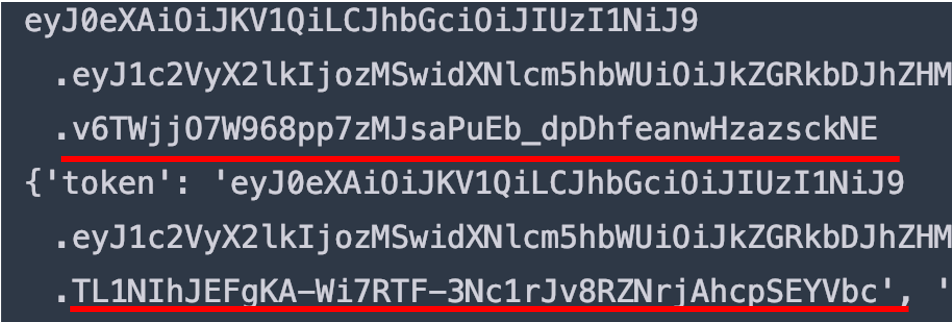

# TEST Script(DRF)

## Test에 사용되는 View & Serializer

[[Code](https://github.com/navill/pure_restapi/blob/ba19edeaeb01e4d3fec358aa52e7dce8e77ea144/src/status/api/views.py#L50)] StatusAPIView

[[Code](https://github.com/navill/pure_restapi/blob/ba19edeaeb01e4d3fec358aa52e7dce8e77ea144/src/status/api/serializers.py#L42)] StatusSerializer

---


### Token 획득

```python
import os
import requests
import json

AUTH_ENDPOINT = "http://127.0.0.1:8000/api/auth/"
REFRESH_ENDPOINT = "http://127.0.0.1:8000/api/auth/jwt/refresh/"

headers = {
    'Content-Type': 'application/json',
}

data = {
    'username': 'jihoon',
    'password': 'password',
}
# json 데이터를 이용할 경우(application/json) 반드시 json.dumps로 전달
r = requests.post(AUTH_ENDPOINT, data=json.dumps(data), headers=headers)
token = r.json()['token']
print(token)
# token 출력
```


### Token을 이용해 객체 업데이트(이미지 파일 업로드)

```python
# 위 코드에서 얻은 token 사용
ENDPOINT = "http://127.0.0.1:8000/api/status/28/"
headers2 = {
    # 'Content-Type': 'application/json',
    'Authorization': 'JWT ' + token,
}
data2 = {
    'content': 'this new content post'
}
# script 폴더 내에 이미지가 있어야 한다.
image_path = os.path.join(os.getcwd(), 'django-icon-0.jpg')
print(image_path)
with open(image_path, 'rb') as image:
    file_data = {
        # serializer field
        'image': image
    }
    # data는 raw(JSON이 아닌 python 데이터 타입)데이터를 사용한다.
    r = requests.put(ENDPOINT, data=data2, headers=headers2, files=file_data)
    print(r.text)
```



- 정상적으로 객체가 업데이트 된다.


### 객체 생성(이미지 업로드)

```python
# image upload test
def upload_image(headers):
    endpint = f"http://127.0.0.1:8000/api/status/"
    headers = {
        # "Content-Type": "application/json",
        "Authorization": "JWT " + get_token(headers, user_data),
    }

    with open(image_path, 'rb') as image:
        file_data = {
            # serializer field
            'image': image
        }

        post_data = {'content': 'some random content'}  # json.dumps({'content': 'some random content'})
        posted_response = requests.post(endpint, data=post_data, headers=headers, files=file_data)

        print(posted_response.text)

upload_image(headers)
```




### Refresh Token

```python
def do_refresh_token(endpoint=ENDPOINT):
    auth_endpoint = "http://127.0.0.1:8000/api/auth/register/"
    refresh_endpoint = "http://127.0.0.1:8000/api/auth/jwt/refresh/"

    headers = {
        'Content-Type': 'application/json',
    }

    data = {
        'username': 'ddddl2ads5dfd132',
        'email': '53dd2@naver.com',
        'password': '1234',
        'password2': '1234',
    }

    data_content = {
        'content': 'this new content post'
    }
    # json 데이터를 이용할 경우(application/json) 반드시 json.dumps로 전달 - 회원가입 후 토큰 획득
    r = requests.post(auth_endpoint, data=json.dumps(data), headers=headers)
    token = r.json()['token']
    print(token)

    refresh_token = {
        'token': str(token)
    }
    # token 값 변경
    import time
    time.sleep(2)
    r = requests.post(refresh_endpoint, data=json.dumps(refresh_token), headers=headers)
    print(r.json())


do_refresh_token()
```



